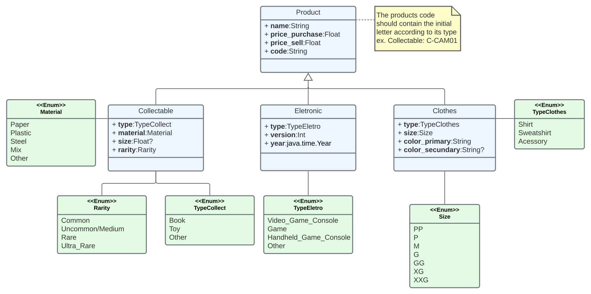

# Kotlin-Project
`Author: Sophie Dilhon - @AHalic`

Mini Kotlin Project developed for the Mobile's class. This projected consisted in a store's management system. 


## Products representation
The Products are represented as classes, and they can be of three different categories, each with its specials attributes. The classes representation is shown in the image below.




## Functionalities 
The system has three major functionalities, an inventory control (by category or by products), a balance sheet generator and a tool for product searching (this tool is optional, so it will only be used if the specific csv is passed). For that, it needs three csv inputs. The first being all products bought by the store (name: compras.csv), the second, the products that were sold (name: vendas.csv), and finally some information about products to be searched (name: busca.csv). 


## Program Execution
The program can be execute running the following commands at the prompt:
```
./gradlew jar 
java -jar miniprojeto.jar <input directory> <output directory>
```

## References
The csv reading was made using the implementation avaible in this [link](https://github.com/doyaaaaaken/kotlin-csv)
